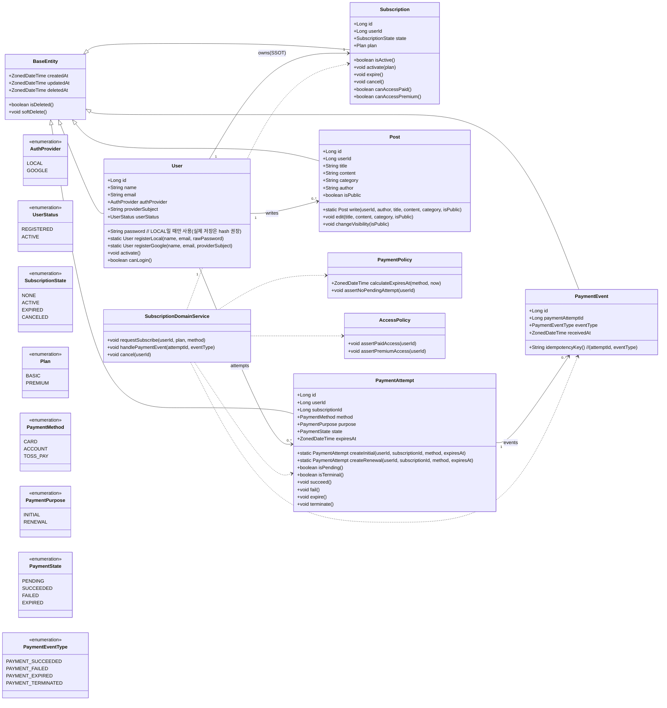

# 클래스 다이어그램

```mermaid
classDiagram
    direction LR
    class BaseEntity {
        +ZonedDateTime createdAt
        +ZonedDateTime updatedAt
        +ZonedDateTime deletedAt
        +boolean isDeleted()
        +void softDelete()
    }

    class User {
        +Long id
        +String name
        +String email
        +String password  // LOCAL일 때만 사용(실제 저장은 hash 권장)
        +AuthProvider authProvider
        +String providerSubject
        +UserStatus userStatus

        +static User registerLocal(name, email, rawPassword)
        +static User registerGoogle(name, email, providerSubject)
        +void activate()
        +boolean canLogin()
    }

    class Subscription {
        +Long id
        +Long userId
        +SubscriptionState state
        +Plan plan

        +boolean isActive()
        +void activate(plan)
        +void expire()
        +void cancel()
        +boolean canAccessPaid()
        +boolean canAccessPremium()
    }

    class PaymentAttempt {
        +Long id
        +Long userId
        +Long subscriptionId
        +PaymentMethod method
        +PaymentPurpose purpose
        +PaymentState state
        +ZonedDateTime expiresAt

        +static PaymentAttempt createInitial(userId, subscriptionId, method, expiresAt)
        +static PaymentAttempt createRenewal(userId, subscriptionId, method, expiresAt)
        +boolean isPending()
        +boolean isTerminal()
        +void succeed()
        +void fail()
        +void expire()
        +void terminate()
    }

    class PaymentEvent {
        +Long id
        +Long paymentAttemptId
        +PaymentEventType eventType
        +ZonedDateTime receivedAt

        +String idempotencyKey()  // (attemptId, eventType)
    }

    class Post {
        +Long id
        +Long userId
        +String title
        +String content
        +String category
        +String author
        +boolean isPublic

        +static Post write(userId, author, title, content, category, isPublic)
        +void edit(title, content, category, isPublic)
        +void changeVisibility(isPublic)
    }

%% Domain services (정합성의 핵심은 여기)
    class SubscriptionDomainService {
        +void requestSubscribe(userId, plan, method)
        +void handlePaymentEvent(attemptId, eventType)
        +void cancel(userId)
    }

    class PaymentPolicy {
        +ZonedDateTime calculateExpiresAt(method, now)
        +void assertNoPendingAttempt(userId)
    }

    class AccessPolicy {
        +void assertPaidAccess(userId)
        +void assertPremiumAccess(userId)
    }

%% enums
    class AuthProvider {
        <<enumeration>>
        LOCAL
        GOOGLE
    }
    class UserStatus {
        <<enumeration>>
        REGISTERED
        ACTIVE
    }
    class SubscriptionState {
        <<enumeration>>
        NONE
        ACTIVE
        EXPIRED
        CANCELED
    }
    class Plan {
        <<enumeration>>
        BASIC
        PREMIUM
    }
    class PaymentMethod {
        <<enumeration>>
        CARD
        ACCOUNT
        TOSS_PAY
    }
    class PaymentPurpose {
        <<enumeration>>
        INITIAL
        RENEWAL
    }
    class PaymentState {
        <<enumeration>>
        PENDING
        SUCCEEDED
        FAILED
        EXPIRED
    }
    class PaymentEventType {
        <<enumeration>>
        PAYMENT_SUCCEEDED
        PAYMENT_FAILED
        PAYMENT_EXPIRED
        PAYMENT_TERMINATED
    }

%% inheritance
    BaseEntity <|-- User
    BaseEntity <|-- Subscription
    BaseEntity <|-- PaymentAttempt
    BaseEntity <|-- PaymentEvent
    BaseEntity <|-- Post

%% relationships
    User "1" --> "1" Subscription : owns(SSOT)
    User "1" --> "0..*" PaymentAttempt : attempts
    PaymentAttempt "1" --> "0..*" PaymentEvent : events
    User "1" --> "0..*" Post : writes

    SubscriptionDomainService ..> PaymentPolicy
    SubscriptionDomainService ..> AccessPolicy
    SubscriptionDomainService ..> Subscription
    SubscriptionDomainService ..> PaymentAttempt
    SubscriptionDomainService ..> PaymentEvent

```
