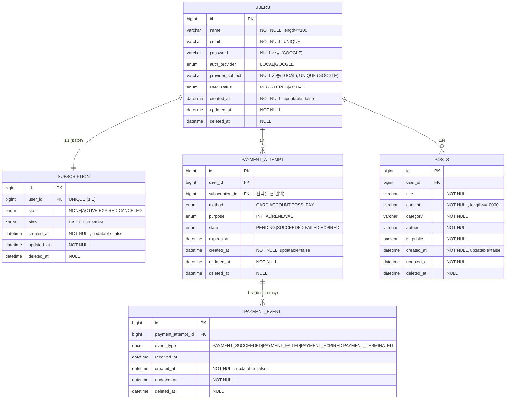

```mermaid
erDiagram
    USERS ||--|| SUBSCRIPTION : "1:1 (SSOT)"
    USERS ||--o{ PAYMENT_ATTEMPT : "1:N"
    PAYMENT_ATTEMPT ||--o{ PAYMENT_EVENT : "1:N (idempotency)"
    USERS ||--o{ POSTS : "1:N"

    USERS {
        bigint id PK
        varchar name "NOT NULL, length<=100"
        varchar email "NOT NULL, UNIQUE"
        varchar password "NULL 가능 (GOOGLE)"
        enum auth_provider "LOCAL|GOOGLE"
        varchar provider_subject "NULL 가능(LOCAL), UNIQUE (GOOGLE)"
        enum user_status "REGISTERED|ACTIVE"

        datetime created_at "NOT NULL, updatable=false"
        datetime updated_at "NOT NULL"
        datetime deleted_at "NULL"
    }

    SUBSCRIPTION {
        bigint id PK
        bigint user_id FK "UNIQUE (1:1)"
        enum state "NONE|ACTIVE|EXPIRED|CANCELED"
        enum plan "BASIC|PREMIUM"

        datetime created_at "NOT NULL, updatable=false"
        datetime updated_at "NOT NULL"
        datetime deleted_at "NULL"
    }

    PAYMENT_ATTEMPT {
        bigint id PK
        bigint user_id FK
        bigint subscription_id FK "선택(구현 편의)"
        enum method "CARD|ACCOUNT|TOSS_PAY"
        enum purpose "INITIAL|RENEWAL"
        enum state "PENDING|SUCCEEDED|FAILED|EXPIRED"
        datetime expires_at

        datetime created_at "NOT NULL, updatable=false"
        datetime updated_at "NOT NULL"
        datetime deleted_at "NULL"
    }

    PAYMENT_EVENT {
        bigint id PK
        bigint payment_attempt_id FK
        enum event_type "PAYMENT_SUCCEEDED|PAYMENT_FAILED|PAYMENT_EXPIRED|PAYMENT_TERMINATED"
        datetime received_at

        datetime created_at "NOT NULL, updatable=false"
        datetime updated_at "NOT NULL"
        datetime deleted_at "NULL"
    }

    POSTS {
        bigint id PK
        bigint user_id FK
        varchar title "NOT NULL"
        varchar content "NOT NULL, length<=10000"
        varchar category "NOT NULL"
        varchar author "NOT NULL"
        boolean is_public "NOT NULL"

        datetime created_at "NOT NULL, updatable=false"
        datetime updated_at "NOT NULL"
        datetime deleted_at "NULL"
    }


```
