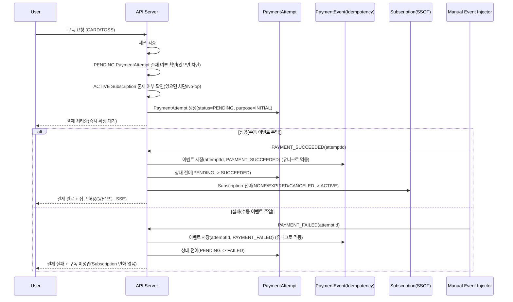
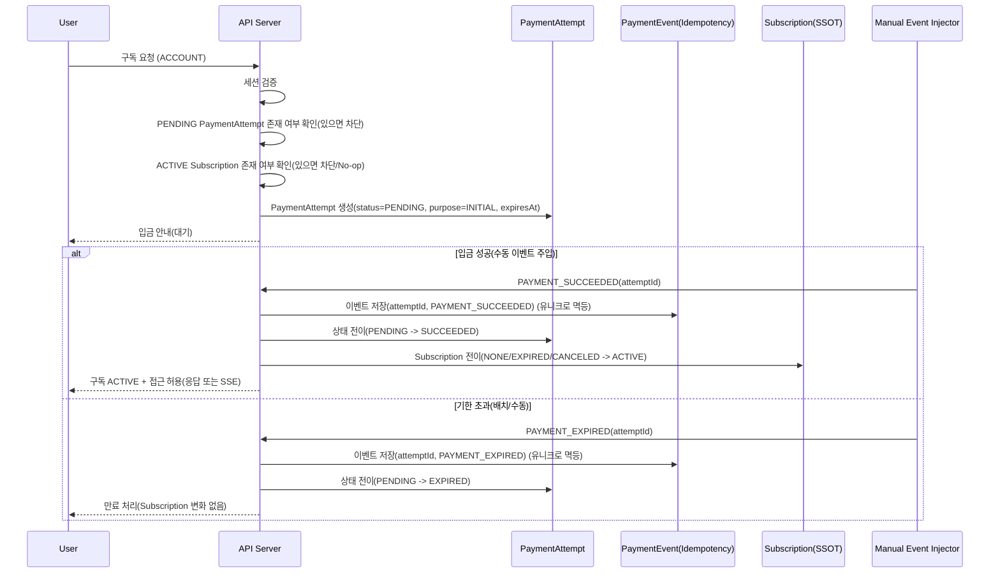
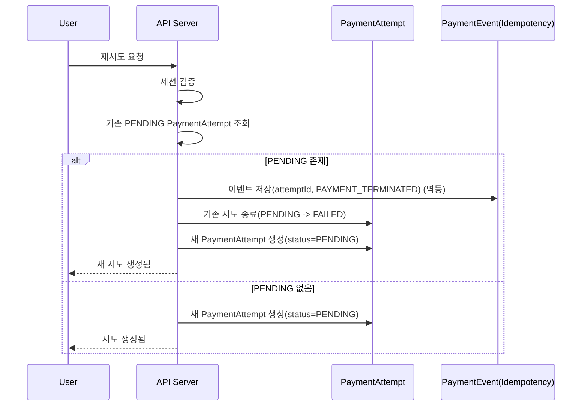
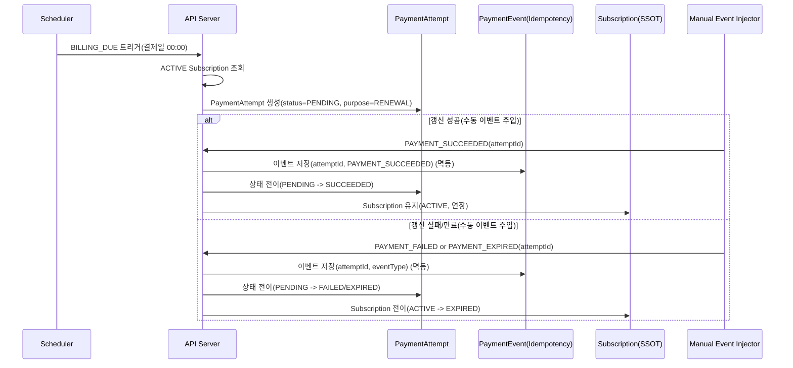
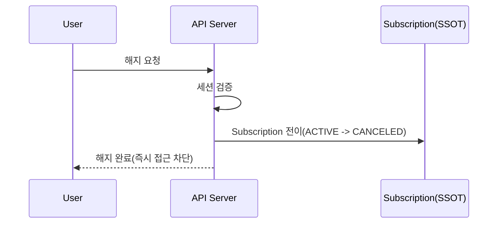
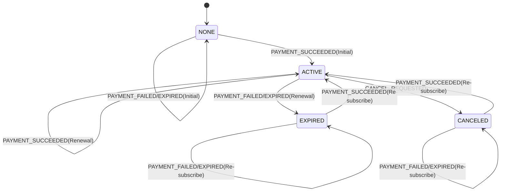
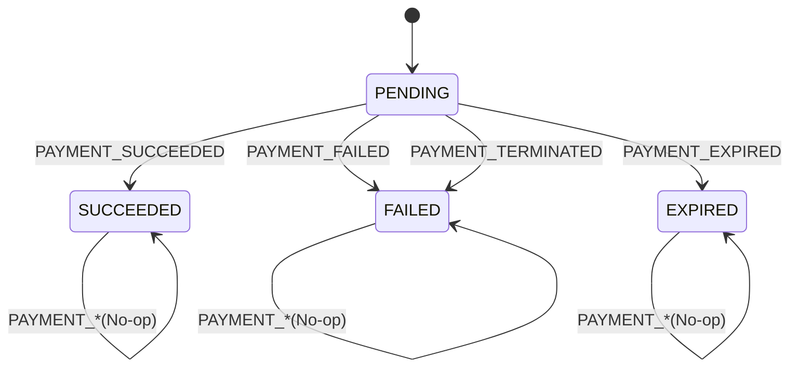

# 구독 결제 시퀀스 다이어그램

> 전제: **세션 기반 로그인**. 결제/구독 행위는 로그인 필수.  
> 전제: Subscription은 SSOT, “진행 중”은 PaymentAttempt(PENDING)로만 표현.

---

## 1) 카드 / 토스페이 (즉시 확정 시뮬레이션)

## 2) 계좌 이체 (비동기 확정 시뮬레이션)

## 3) 재시도(중복 결제 차단 + 기존 PENDING 종료 후 재시도)

## 4) 정기 결제(갱신) 성공/실패 흐름 (정책 미정, 전이 규칙만 고정)

## 5) 구독 해지 (즉시 접근 차단)

## 6) 상태 다이어그램 (Subscription)

## 7) 상태 다이어그램 (PaymentAttempt)

